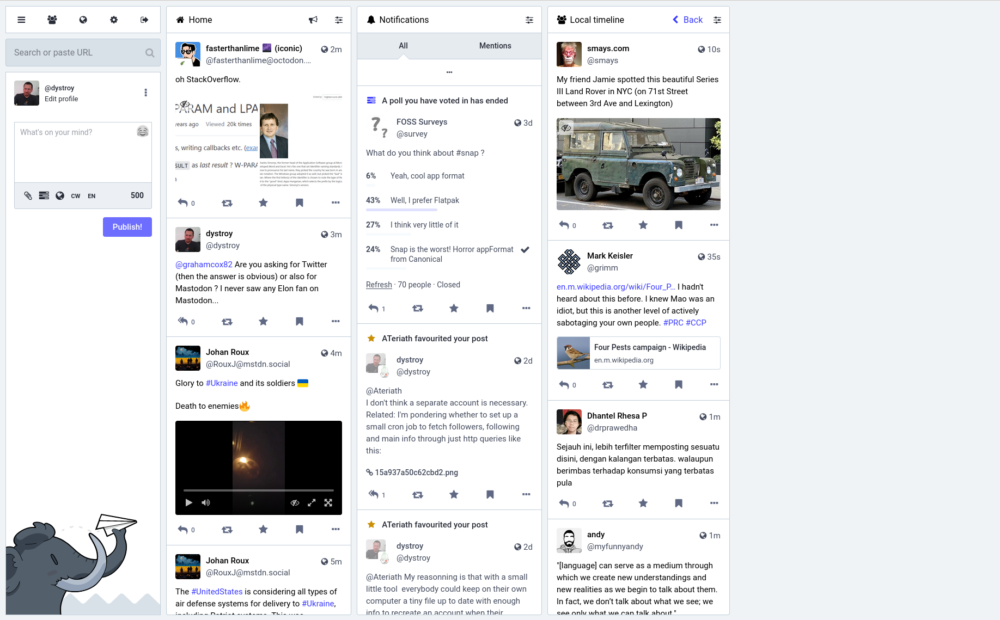
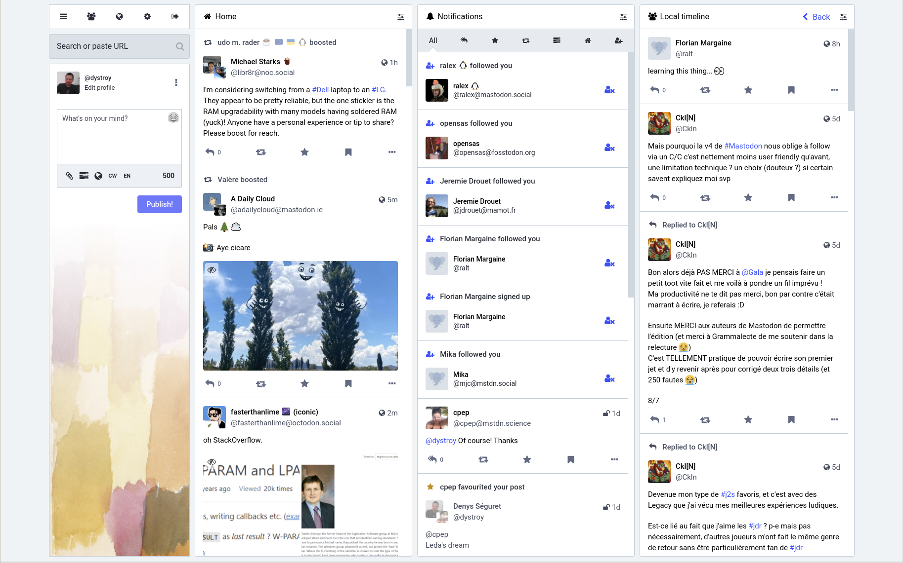
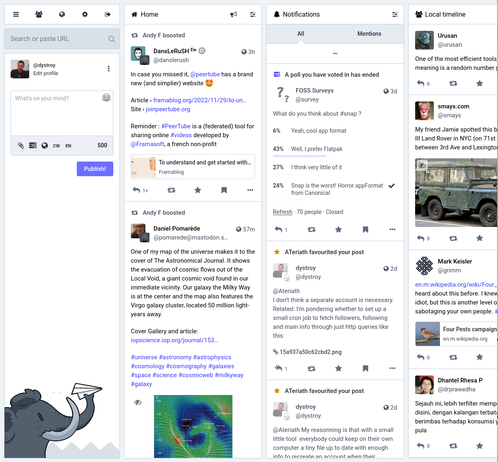
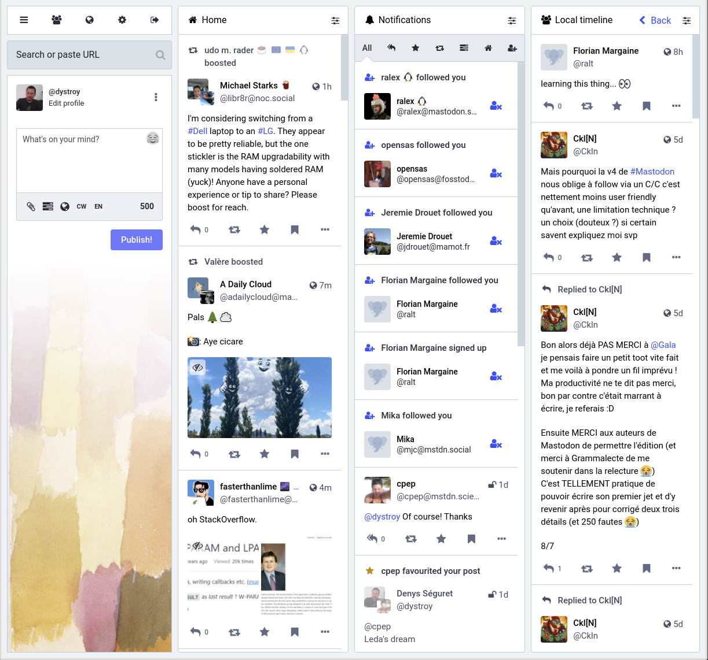

# mastodys-settings

## Styling

The content of [custom.css](./custom.css) can be pasted into the *Custom CSS* field of the page you find following *Settings/Administration/Server Settings/Appearance*.

This style fills in a prettier way the bottom part of the left column.

It also fixes some shortcomings of the "advanced" view:

* content stuck to the left side of the window
* too thin columns even when there's a lot of room
* hidden columns when the window isn't wide enough

Here are a few pictures to compare:

**Standard Style in a wide window:**

**Mastodys Style in a wide window:**

(columns are wider, and the whole is centered)

**Standard Style in a medium window:**

**Mastodys Style in a medium window:**

(the rightest column isn't cut or hidden)

Overall, this is a *very* small change. I take suggestions for more improvements but I'd rather not change more than what's usefull.
